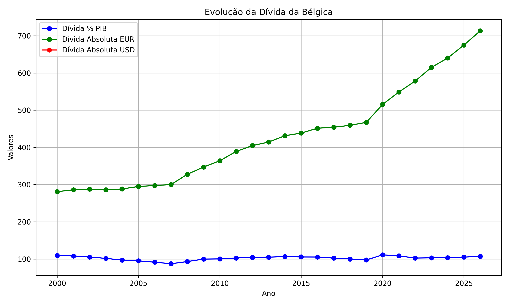
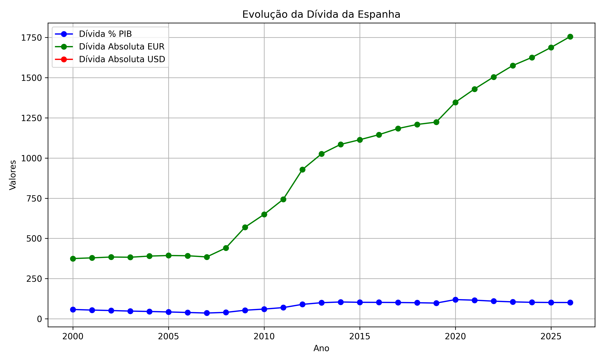
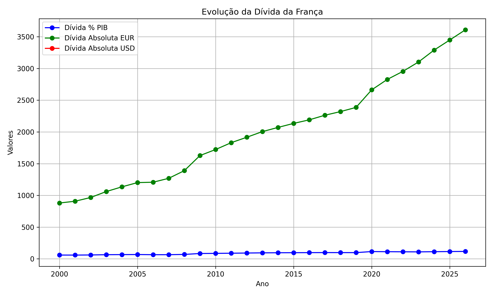
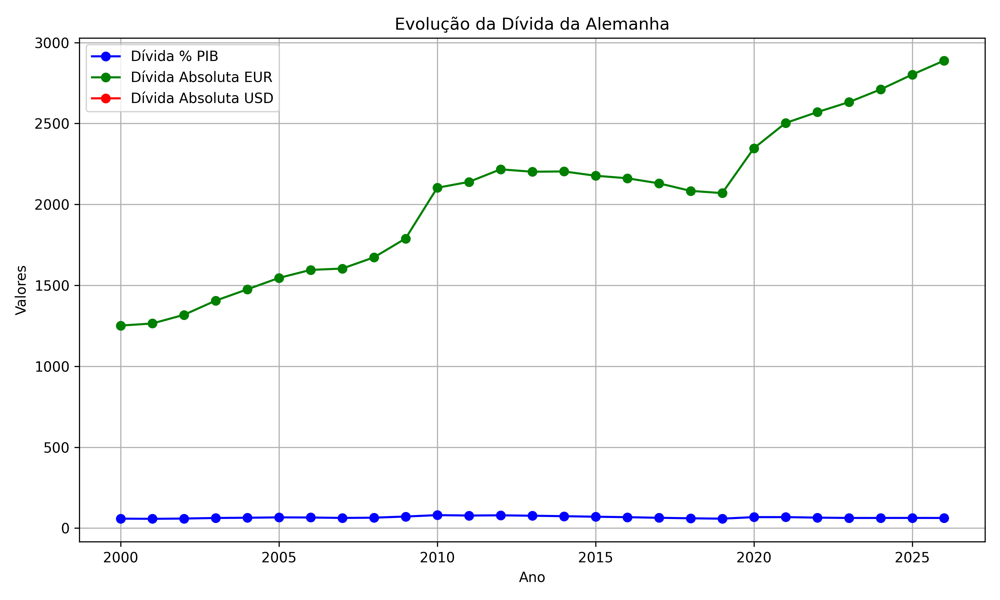
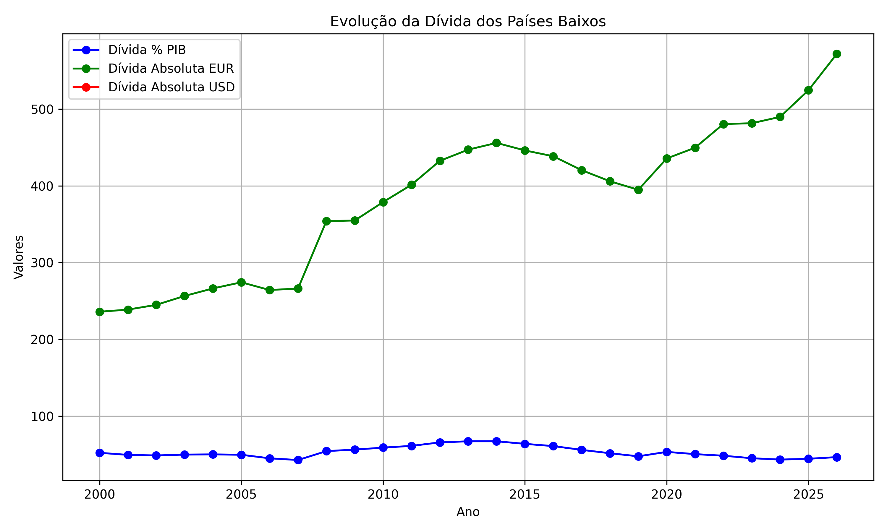

# 🇪🇺 Análise e Visualização de Dados: A Dívida Pública da Zona do Euro (Fonte AMECO)

Este projeto contém uma Análise Exploratória de Dados (AED) da dívida pública consolidada de diversos países da Zona do Euro, utilizando séries temporais da base de dados AMECO (Annual Macro-Economic Database) da Comissão Europeia. O foco é identificar tendências históricas e o impacto de grandes choques econômicos.

## 💾 Estrutura do Projeto

* **`AMECO18.CSV`**: O conjunto de dados bruto da base AMECO utilizado na análise.
* **`AMECO_Analytics.ipynb`**: O notebook principal em Python (Jupyter) que contém todo o código para carregamento, limpeza, tratamento e visualização dos dados.
* **`analytics/`**: Pasta contendo todos os gráficos gerados durante a análise.

## ℹ️ Fonte de Dados

O banco de dados AMECO é a fonte oficial de séries temporais macroeconómicas da Direção-Geral dos Assuntos Económicos e Financeiros da Comissão Europeia.

* **Link Oficial:** [AMECO database - European Commission](https://economy-finance.ec.europa.eu/economic-research-and-databases/economic-databases/ameco-database_en)

---

## 📊 Gráficos de Análise (Amostra)

Os gráficos abaixo mostram a evolução da Dívida Pública, geralmente em porcentagem do PIB, ao longo do tempo para países selecionados, destacando as diferentes respostas fiscais às crises.

### Bélgica (Belgium)

### Espanha (Spain)

### França (France)

### Alemanha (Germany)

### Itália (Italy)

### Países Baixos (Netherlands)

---

## 📝 Conclusão e Análise Final

A análise dos gráficos de séries temporais de dívida pública (% do PIB) revela padrões distintos de reação fiscal a choques econômicos na Europa.

### 1. Crise Financeira Global e da Zona do Euro (2008–2015)

O período foi marcado por uma **subida prolongada e gradual da dívida** na maioria dos países.

* Houve **forte aumento da dívida pública** devido a pacotes de estímulo, resgates bancários, queda da arrecadação e aumento de gastos sociais.
* **Padrão:** O aumento foi mais acentuado e duradouro em países como **Espanha** e **Itália** (mostrando uma "explosão de dívida"), enquanto **Alemanha** e **Países Baixos** cresceram de forma mais moderada.

### 2. Crise Sanitária e Geopolítica (2020 em diante)

A crise da COVID-19 resultou em um choque fiscal **instantâneo e sincronizado**, seguido por pressões geopolíticas.

* Um novo **pico agudo de dívida no ano de 2020** foi observado em todas as nações devido aos gastos emergenciais da **COVID-19** (subsídios, queda da atividade econômica).
* A **guerra na Ucrânia (a partir de 2022)** adicionou pressão fiscal (gastos em defesa, energia e inflação), consolidando a trajetória de alta em países como **Bélgica, Espanha e Itália**, e retomando a alta em **Alemanha** e **Países Baixos**.

---

💡 **Insight:**  
A projeção da dívida públ
---

